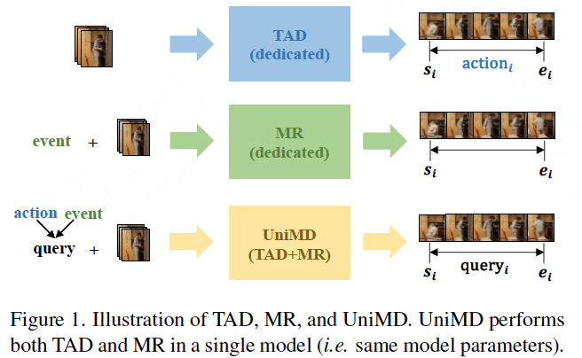
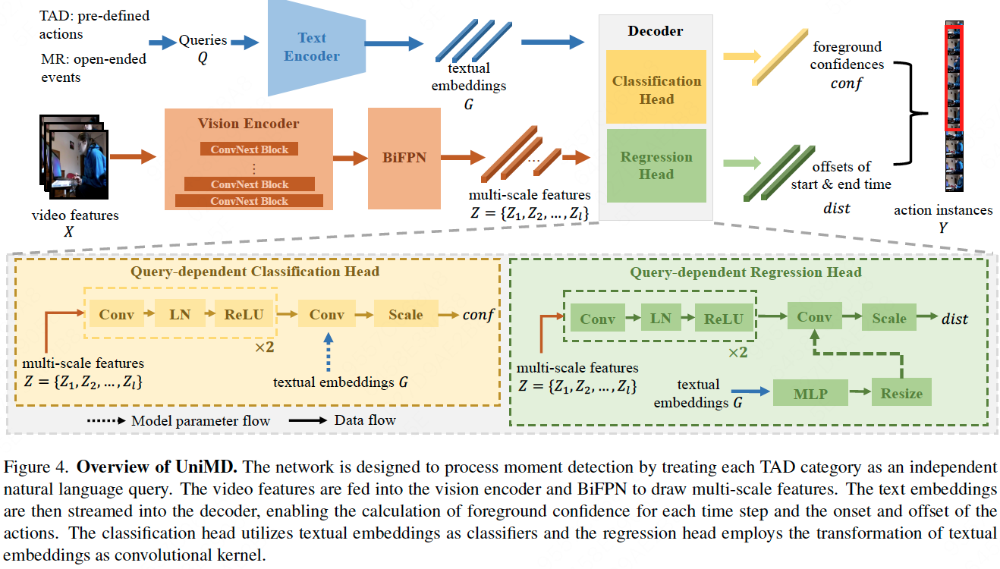

# UniMD: Towards Unifying Moment Retrieval and Temporal Action Detection

## Introduction

In this paper, we aim to investigate the potential synergy between TAD and MR. Firstly, we propose a unified architecture, termed Unified Moment Detection (UniMD), for both TAD and MR, as shown in Fig.1. It transforms the inputs of the two tasks, namely actions for TAD or events for MR, into a common embedding space, and utilizes two novel querydependent decoders to generate a uniform output of classification score and temporal segments, as shown in Fig.4. Secondly, we explore the efficacy of two task fusion learning approaches, pre-training and co-training, in order to enhance the mutual benefits between TAD and MR. Extensive experiments demonstrate that the proposed task fusion learning scheme enables the two tasks to help each other and outperform the separately trained counterparts.

This repository will contain the code for UniMD and the video features used in the paper. Our code is built upon the codebase from [actionformer](https://github.com/happyharrycn/actionformer_release).

## Changelog

* 02/04/2024: we create the code repo and release the video features, text embeddings and groundtruth used in the paper.

## Video Features

We provide the video features of three paired datasets used in our experiments, including "Ego4D-MQ & Ego4D-NLQ", "Charades & Charades-STA", and "ActivityNet & ActivityNet-caption".

* **Ego4D-MQ & Ego4D-NLQ:** we use the features provided by InternVideo-ego4D. Their features are 1024-D and based on clips of 16 frames, with a frame rate of 30 and a stride of 16 frames. <u>It is important to note</u> that these features are extracted by VideoMAE-L, pretrained on the verb and noun subset without second finetuning stage, such as "K700→ Verb" in the InternVideo-ego4D paper. The features can be available in the section "Video Features for MQ and NLQ" in [InternVideo-ego4D](https://github.com/OpenGVLab/ego4d-eccv2022-solutions). 
* **Charades & Charades-STA:** we use I3D and CLIP features as the input video features. The I3D features are extracted from snippets with a window of 16 frames and a stride of 4. Each snippet yields two types of 1024-Dfeatures: one based on RGB frames decoded at 24 fps, and the other based on optical flow. The I3D features are formed by concatenating the RGB features and optical flow features, resulting in a 2048-D feature. In addition, we extract CLIP features every 4 frames using CLIP-B. 
  * I3D: we extract I3D features following the [method](https://github.com/Finspire13/pytorch-i3d-feature-extraction), and they can be downloaded in [google drive](https://drive.google.com/file/d/1jivG3olcvhayAxE7waec7HoRwxFtJTlT/view?usp=sharing).
  * CLIP: features can be downloaded in [google drive](https://drive.google.com/file/d/1WtqmkPMS5kiXe9RFL6xYOEVdE8jle-2P/view?usp=sharing).

* **ActivityNet & ActivityNet-caption:** we follow the [InternVideo](https://arxiv.org/pdf/2212.03191.pdf) for feature extraction, the backbone of which is named InternVideo and based on ViT-H. Each step of the video features is extracted from a continuous 16 frames with a stride of 16 in 30 fps video. The features can be downloaded in [here](https://github.com/OpenGVLab/InternVideo/tree/main/InternVideo1/Downstream/Temporal-Action-Localization). The TSP features can be downloaded in [here](https://github.com/happyharrycn/actionformer_release?tab=readme-ov-file#to-reproduce-our-results-on-activitynet-13).

## query embeddings & groundtruth

* **Ego4D:** In Ego4D-MQ (TAD), we use the category name itself as input to extract text embeddings, without additional prefixes/suffixes/learnable prompts. In NLQ (MR) we use natural language descriptions from annotations. The text embeddings of queries as well as groundtruth can be downloaded in [google drive](https://drive.google.com/file/d/1Kefm4NtAdf3KIsMskvK5QpwGB1t2uwbA/view?usp=sharing).
* **Charades & Charades-STA**: the formation method of text embeddings is the same as Ego4d, which can be downloaded in [google drive](https://drive.google.com/file/d/1_Piovqjal4FD8NiHc6b9YadL0qeHLrT4/view?usp=sharing).
* **ActivityNet & ActivityNet-caption:** in TAD, we firstly draw text embeddings of whole 200 categories, and then average the normalized text embeddings of whole categories for action proposals. When inferring, we use external video action recognition to obtain specific action categories. In MR, the procedure of drawing text embedding is the same as the Ego4D and Charades. Text embeddings and GT can be downloaded in [google drive](https://drive.google.com/file/d/1RjCQkC1OkZpb-f8c1xCQAHjBLRzOCRnM/view?usp=drive_link).

## Inference

the code will be released soon

## Citation

## Acknowledgement

This repository is built based on [ActionFormer](), [InternVideo-ego4d](https://github.com/OpenGVLab/ego4d-eccv2022-solutions), [InternVideo](https://github.com/OpenGVLab/InternVideo?tab=readme-ov-file), [i3d-feature-extraction](https://github.com/Finspire13/pytorch-i3d-feature-extraction) repository.

